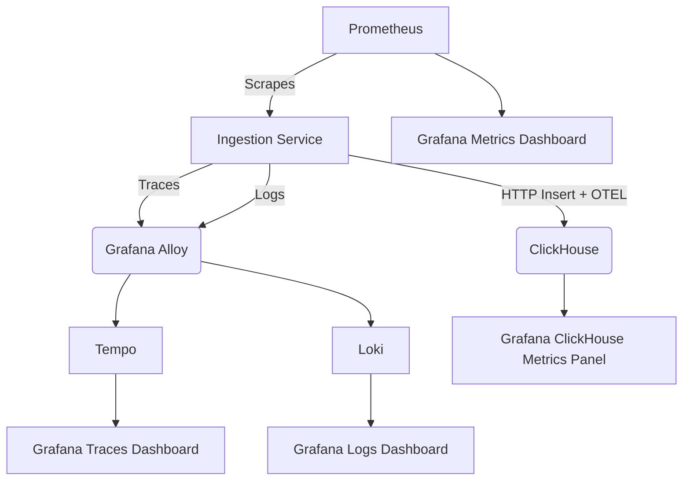
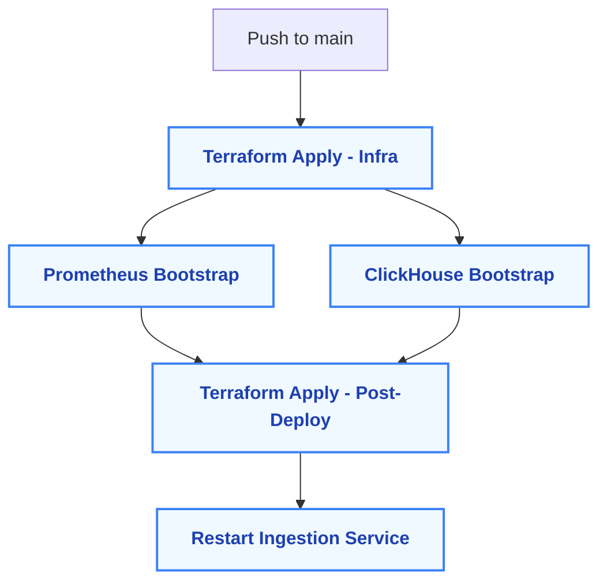

# 🧠 ClickHouse Observability Platform

This project provisions a real-time observability stack built on AWS, EKS, Terraform, Argo CD, and ClickHouse — complete with OTEL tracing, metrics, and logs via Grafana, Tempo, Loki, and Grafana Alloy.

> Built for OLAP ingestion, visibility, and GitOps deployment.

## CI Status

| Workflow     | Status                                                                                                                 |
|--------------|------------------------------------------------------------------------------------------------------------------------|
| Terraform    |  |
| Helm Charts  |            |
| Argo CD      |       |


---

## 📦 Platform Overview

## ⚙️ Helm Chart Management Strategy

This project uses a mix of Helm management styles across Argo CD apps to reflect real-world patterns:

| Component             | Helm Strategy           | Notes                                                                 |
|-----------------------|--------------------------|-----------------------------------------------------------------------|
| **ClickHouse**        | Altinity CRDs            | Managed via `ClickHouseInstallation` custom resource (not Helm)       |
| **Grafana**           | Vendored Helm Chart      | Forked and customized inside `helm/grafana/`                          |
| **Grafana Alloy**     | Upstream Helm            | Installed via `grafana/alloy` chart directly                          |
| **Ingestion Service** | From-Scratch Helm Chart  | Custom-built chart under `helm/ingestion-service/`                   |
| **Loki**              | Vendored Helm Chart      | Pulled into repo and configured via `helm/loki/`                      |
| **Prometheus**        | Upstream Helm            | Managed with official `prometheus-community/kube-prometheus-stack`   |
| **Tempo**             | Upstream Helm            | Installed from Grafana's upstream Helm chart                         |
| **Promtail**          | Upstream Helm (Optional) | Included but not deployed; logs go Alloy → Loki                      |

> This strategy shows how to mix upstream charts, custom charts, and CRDs while keeping everything GitOps-managed via Argo CD.


| Component           | Purpose                                                                  |
|---------------------|--------------------------------------------------------------------------|
| **ClickHouse**       | High-speed OLAP database for event ingestion                            |
| **Ingestion Service**| Modular Go service with synthetic events + OTEL trace injection         |
| **Grafana**          | Visualization of logs, traces, and metrics                              |
| **Grafana Alloy**    | Routes OTEL traces and logs to Tempo/Loki (Promtail not required)       |
| **Tempo**            | Trace backend for OTEL                                                  |
| **Loki**             | Log backend (receives logs directly from Alloy)                         |
| **Prometheus**       | Scrapes metrics from services via ServiceMonitor CRDs                   |
| **Pixie**            | eBPF-based live tracing (optional)                                      |
| **Promtail**         | Optional log forwarder — included but not enabled by default            |

---

## 📁 Full Repo Structure

```
clickhouse-observability-platform/
├── apps/                            # Argo CD Application manifests
├── helm/                            # Vendor charts (Grafana, Loki, Alloy, etc.)
├── terraform/                       # Infra as code (VPC, EKS, IAM, Argo CD, CH)
├── ddl/                             # ClickHouse schema DDL
├── k8s/                             # Raw Kubernetes YAML (e.g. ClickHouseInstallation)
├── prometheus-crds/                # Required CRDs for Prometheus setup
├── scripts/                         # Bootstrap + automation scripts
├── remote-state-setup.md           # Standalone version of backend setup instructions
└── README.md                        # You're here.
```

---

## 🚀 Quickstart

> This assumes you’ve completed the remote state setup (see below) and are provisioning the dev environment.

### 🔐 Required Terraform Variables

Ensure the following values are defined in your `terraform.tfvars`:

```hcl
clickhouse_admin_password     = "your-secure-password"
clickhouse_ingestor_password  = "your-secure-password"
```

These are used to create and manage ClickHouse users.

---

### 1️⃣ Provision Infrastructure

```bash
cd terraform/environments/dev
terraform init
terraform apply -auto-approve -var="enable_postdeploy=false"
```

### 2️⃣ Bootstrap Prometheus

```bash
./scripts/bootstrap-prometheus.sh
```

Installs required Prometheus CRDs and syncs the Argo CD app.

> ℹ️ Note: The Prometheus Argo CD application is synced automatically inside this script.

### 3️⃣ Sync Argo CD Applications

```bash
argocd app sync clickhouse
argocd app sync grafana
argocd app sync grafana-alloy
argocd app sync tempo
argocd app sync loki
argocd app sync ingestion-service
# Optional: Promtail (not deployed by default)
argocd app sync promtail
```

> Promtail is included as an optional Argo CD application. Logs are routed directly from Alloy to Loki.

### 4️⃣ Bootstrap ClickHouse

```bash
./scripts/bootstrap-clickhouse.sh
```

### 5️⃣ Port Forward ClickHouse & Finalize

```bash
./scripts/portforward-clickhouse.sh
terraform apply -auto-approve -var="enable_postdeploy=true"
kubectl rollout restart deployment ingestion-service -n ingestion
```

---

## 🔗 Argo CD Access

### Port Forward the UI

```bash
kubectl port-forward svc/argocd-server -n argocd 8080:80
open http://localhost:8080
```

### Get Admin Password

```bash
kubectl -n argocd get secret argocd-initial-admin-secret   -o jsonpath="{.data.password}" | base64 -d && echo
```

---

## 📊 Grafana Access

```bash
kubectl port-forward svc/grafana -n observability 3000:3000
open http://localhost:3000
```

- Username: `admin`
- Password: `admin123`

---

## 🔍 Pixie Integration (Optional)

Pixie adds eBPF-based live observability to your Kubernetes workloads, enabling real-time flame graphs, service maps, and tracing of pods.

This project uses the Pixie CLI (`px`) to deploy Vizier into the cluster.

### Authenticate with Pixie

```bash
px auth login
```

### Deploy Pixie

```bash
px deploy --namespace=observability --cluster_name=clickhouse-observability-cluster
```

> Safe to rerun if needed. Installs Vizier automatically.

### Access Pixie UI

```bash
px ui
```

Opens [https://work.pixielabs.ai](https://work.pixielabs.ai) in your browser.

---

## 🧪 Accessing ClickHouse + Table Schema

### Port Forward ClickHouse (Manually)

```bash
kubectl port-forward svc/clickhouse-clickhouse -n clickhouse 8123:8123
```

> This opens port 8123 for HTTP access to the ClickHouse web UI.

### 🖥️ ClickHouse Web UI

Once port-forwarded, open:

[http://localhost:8123](http://localhost:8123)

Features:
- Ad-hoc SQL queries via curl or clients
- Table access: `events_db.events`

### 📐 `events` Table Overview

| Column     | Type            | Description                           |
|------------|------------------|---------------------------------------|
| `timestamp`| `DateTime64(3)` | Event timestamp (ms precision, UTC)   |
| `user_id`  | `String`        | Synthetic user identifier             |
| `action`   | `String`        | Event type (e.g., click, view)        |
| `payload`  | `String`        | Free-form metadata payload            |

> MergeTree-engine, indexed by `(timestamp, user_id)`.

### 🔍 Sample Query

To verify ingestion and see results:

```sql
SELECT *
FROM events_db.events
LIMIT 10;
```

Or via curl:

```bash
curl -s 'http://localhost:8123/?query=SELECT%20*%20FROM%20events_db.events%20LIMIT%2010'
```

> This assumes your `events` table was created inside the `events_db` database (as defined in `ddl/init.sql`).


## 📦 Remote State with S3 and DynamoDB

This project uses S3 + DynamoDB for remote state and locking.

### One-Time Setup

```bash
cd terraform/backend-setup
terraform init
terraform apply
```

Creates:

- S3 bucket `clickhouse-observability-tf-state`
- DynamoDB table `terraform-locks`

### Migrate State for Dev

```bash
cd terraform/environments/dev
terraform init -reconfigure
```

### Cleanup Local State

```bash
rm terraform.tfstate*
```

Add to `.gitignore`:

```
*.tfstate
*.tfstate.*
.terraform/
.terraform.lock.hcl
```

---

## ☁️ Required GitHub Actions Secrets

Set these secrets in your repo for CI/CD:

| Secret Name                   | Purpose                                                |
|-------------------------------|--------------------------------------------------------|
| `AWS_ACCESS_KEY_ID`           | AWS provisioning access                                |
| `AWS_SECRET_ACCESS_KEY`       | AWS provisioning access                                |
| `CLICKHOUSE_ADMIN_PASSWORD`   | Admin password for ClickHouse users                    |
| `CLICKHOUSE_INGESTOR_PASSWORD`| Ingestor user password                                 |
| `KUBECONFIG_BASE64`           | Used by CI to run `kubectl` and `argocd` commands      |
| `ACTIONS_RUNNER_DEBUG`        | Optional debug output                                  |
| `ACTIONS_STEP_DEBUG`          | Optional step output                                   |

---

## 📊 Dashboards & Observability

Dashboards are baked into `helm/grafana/dashboards/`:

| Dashboard                     | Description                              |
|-------------------------------|------------------------------------------|
| `ingestion-service-metrics`   | Event rates, CPU, memory, ingestion QPS  |
| `logs.json`                   | Loki-powered logs (via Alloy)            |
| `tempo-traces.json`           | OTEL traces with linked spans            |

> Linked drilldowns between traces ↔ logs ↔ metrics included.

---

## 🔁 Data Flow Overview



---

## 🛠️ CI/CD Deployment Strategy

## 🗺️ CI/CD Pipeline Diagram




GitHub Actions drives the multi-phase CI/CD lifecycle:

| Phase                      | Description                                                 |
|----------------------------|-------------------------------------------------------------|
| **Infra Apply**            | Base infra setup (`enable_postdeploy=false`)                |
| **Prometheus Bootstrap**   | Installs CRDs + Prometheus via Argo CD                      |
| **ClickHouse Bootstrap**   | Applies schema and waits for readiness                      |
| **Post Deploy**            | Configures users and restarts ingestion service             |

Each phase is orchestrated via `.github/workflows/terraform-cd.yaml`.

---

## 🧰 Shell Script Overview

| Script                      | Purpose                                                     |
|-----------------------------|-------------------------------------------------------------|
| `bootstrap-prometheus.sh`   | CRD install + Prometheus Argo CD sync                       |
| `bootstrap-clickhouse.sh`   | DDL + readiness wait                                        |
| `portforward-clickhouse.sh` | Port-forward + availability test for ClickHouse             |

---