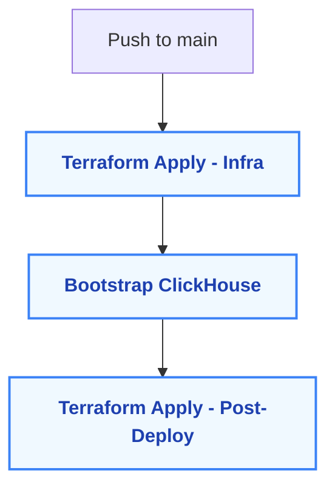

# 🧠 ClickHouse Observability Platform (Terraform Phase)

This repository contains Terraform code for provisioning a production-ready AWS EKS environment to support a real-time observability platform built on ClickHouse, Grafana, Tempo, Loki, and Alloy. It serves as the infrastructure foundation for a GitOps-managed data and telemetry stack.

---

## CI Status

| Workflow | Status                                                                                                                 |
|----------|------------------------------------------------------------------------------------------------------------------------|
| Terraform |  |
| Helm Charts |            |
| Argo CD |       |

## 📁 Repo Structure

```
.
clickhouse-observability-platform/
├── README.md
├── apps/                            # Argo CD Application manifests
│   └── clickhouse.yaml              # GitOps app for ClickHouse via Helm
├── helm/                            # Helm charts for internal components
│   └── clickhouse/                  # Minimal ClickHouse Helm chart
│       ├── Chart.yaml
│       ├── values.yaml
│       └── templates/
│           ├── deployment.yaml
│           └── service.yaml
└── terraform/                       # Full infrastructure-as-code
    ├── environments/
    │   └── dev/                     # Environment-specific config
    │       ├── apps.tf             # Argo CD Application resource via TF
    │       ├── argocd.tf           # Argo CD Helm release
    │       ├── eks.tf              # EKS cluster and node group wiring
    │       ├── iam.tf              # IAM roles and IRSA setup
    │       ├── outputs.tf          # Cluster and app outputs
    │       ├── providers.tf        # AWS, K8s, Helm provider setup
    │       ├── variables.tf
    │       └── vpc.tf              # VPC module wiring
    └── modules/                    # Reusable Terraform modules
        ├── argocd/
        │   ├── main.tf
        │   ├── outputs.tf
        │   └── values.yaml
        ├── eks/
        │   ├── main.tf
        │   ├── outputs.tf
        │   └── variables.tf
        └── vpc/
            ├── main.tf
            ├── outputs.tf
            └── variables.tf

```

---

## 🚀 Infrastructure Provisioning

This portion of the project provisions:

This Terraform stack provisions:

- A highly-available VPC:
  - Public and private subnets across AZs 
  - Route tables, IGW, and NAT Gateways
- An Amazon EKS cluster with:
  - Managed node groups and optional Fargate profiles 
  - IAM roles scoped for Kubernetes workloads
- A GitOps control plane using Argo CD, installed via Helm and Terraform 
  - Exposed locally via port-forwarding 
  - Configured in HTTP mode for development convenience
- Deploys ClickHouse via Argo CD as a Helm chart, with full GitOps lifecycle management
---

## 🛠️ Usage Instructions

```bash
cd terraform/environments/dev

# 1. Format, initialize, and validate
terraform fmt -recursive
terraform init
terraform validate

# 2. Preview changes
terraform plan

# 3. Apply infrastructure
terraform apply
```

---

## 📤 Outputs

Once applied, run:

```bash
terraform output
```

You will see:
- `vpc_id`
- `public_subnet_ids`
- `private_subnet_ids`
- `eks_cluster_name`
- `eks_cluster_endpoint`
- `fargate_profile_name`
- `argocd_admin_password_cmd`
- `argocd_server_url`

## 🔗 Access Argo CD UI Locally
```bash
kubectl port-forward svc/argocd-server -n argocd 8080:80
```
Then visit:

http://localhost:8080

Retrieve the admin password:
```bash
kubectl -n argocd get secret argocd-initial-admin-secret -o jsonpath="{.data.password}" | base64 -d && echo
```
## 📡 Access ClickHouse Locally
```bash
kubectl port-forward svc/clickhouse -n clickhouse 8123:8123
```
Then open:

http://localhost:8123

## ⚙️ Infrastructure Deployment Strategy

This project uses a multi-phase, GitOps-friendly Terraform CD pipeline via GitHub Actions.

### 🚀 Deployment Phases

| Phase | Description |
|-------|-------------|
| **Phase 1 – Infra Apply** | Provisions EKS, IAM, Argo CD, and base infra using `terraform apply` |
| **Phase 2 – Bootstrap** | Installs Prometheus CRDs, waits for ClickHouse, applies SQL DDL |
| **Phase 3 – Post-Deploy Apply** | Runs `terraform apply -var="enable_postdeploy=true"` to create ClickHouse users and ingestion-specific config |
| **Phase 4 – Ingestion Restart** | Restarts ingestion-service to connect with ready ClickHouse instance |

Each phase is defined in `.github/workflows/terraform-cd.yaml` and guarded by stage dependencies.

### 🛡️ Safety Considerations

- Terraform `apply` is restricted to `main` branch
- Optional manual approval gate for production (`workflow_dispatch`)
- ClickHouse readiness is verified before SQL DDL runs

### 🛠️ Bootstrap Script

Bootstrap logic is encapsulated in [`scripts/bootstrap-clickhouse.sh`](scripts/bootstrap-clickhouse.sh) and safely runs inside GitHub-hosted runners without manual intervention.

## 🗺️ CI/CD Pipeline Diagram

